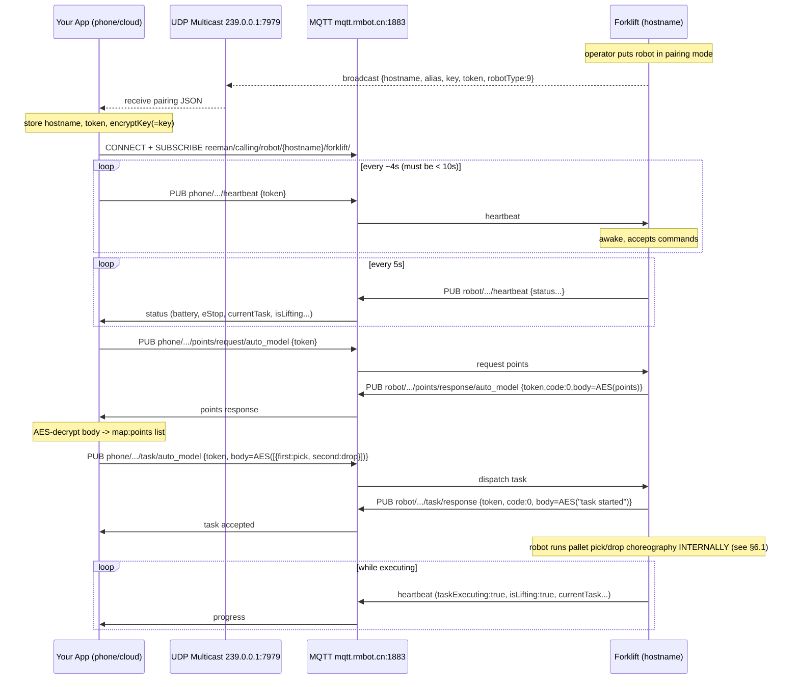

# Reeman Forklift AMR — MQTT Integration Spec (English)

> Reverse-engineered and translated from the vendor docs in `3.0sdk-叉车`:
> `REEMAN+FORKLIFT+CALLING+API.pdf` (MQTT), `REEMAN SLAM WEB API 3.0` and
> `SLAM+3.0+API.pdf` (HTTP/serial). Robot type **9 = forklift (叉车)**.

---

## 0. Mental model — which layer am I on?

Reeman exposes the forklift at three layers. **This spec is the MQTT layer.**

```
┌─────────────────────────────────────────────────────────────────────┐
│  YOUR app (phone / cloud / WMS)                                       │
│        │  MQTT over internet  (mqtt.rmbot.cn:1883)   ◄── THIS SPEC    │
│        ▼                                                              │
│  Robot Android head unit                                              │
│        │  UART serial 115200 (/dev/ttyS*)  — reeman-serialport SDK    │
│        ▼                                                              │
│  ROS navigation board  (executes pallet pick/drop choreography)       │
└─────────────────────────────────────────────────────────────────────┘
```

**Key consequence:** over MQTT you dispatch a **high-level task** ("pick at
point A, drop at point B"). You do **NOT** drive `pallet:start`, `forklift_arm`,
lateral-offset correction, etc. — that low-level choreography runs *inside the
robot* (documented in §6 for reference only). You just dispatch and monitor.

---

## 1. Connection parameters

| Thing | Value |
|---|---|
| Pairing discovery | UDP **multicast `239.0.0.1:7979`** |
| MQTT broker | **`mqtt.rmbot.cn`** |
| MQTT port | **`1883`** (plaintext — confidentiality comes from per-message AES) |
| Robot type id | `9` = forklift |

### Credentials obtained during pairing
| Field | Meaning |
|---|---|
| `hostname` | Robot's unique id; used in every topic |
| `alias` | Human-friendly name |
| `key` / `encryptKey` | Shared secret — the **AES key** for message bodies |
| `token` | Issued by the robot at pairing; **must** accompany every message |
| `robotType` | `9` for forklift |

---

## 2. Security & session rules

1. **Token** — every published message includes the pairing `token`. The robot
   uses it to authorize commands and to tell whether a running task was started
   by *this* controller.
2. **AES body encryption** — `body` fields are AES-encrypted, then (per the
   common pattern) Base64-encoded into the JSON string.
   ⚠️ **The exact AES parameters are NOT in the vendor doc** — see
   [§7 Open questions](#7-open-questions-confirm-with-reeman). The reference
   client defaults to **AES-128 / ECB / PKCS7 / Base64**, all overridable.
3. **Heartbeat keep-alive** — the controller must publish a heartbeat
   continuously. **If the robot gets no heartbeat for >10 s it goes dormant and
   ignores all commands.** Send every ~4–5 s. The robot, once awake, publishes
   its own status heartbeat every **5 s**.

---

## 3. Topic map

`{hostname}` = the robot's hostname from pairing.

### Controller → Robot  (`reeman/calling/phone/{hostname}/forklift/…`)
| Purpose | Topic suffix | Payload |
|---|---|---|
| Heartbeat (keep awake) | `heartbeat` | `{"token"}` |
| Request points — calling mode | `points/request/calling_model` | `{"token"}` |
| Request points — auto mode | `points/request/auto_model` | `{"token"}` |
| Request points — manual mode | `points/request/manual_model` | `{"token"}` |
| Request local routes | `points/request/task_model` | `{"token"}` |
| Dispatch — calling task | `task/calling_model` | `{"token","body"}` |
| Dispatch — auto task | `task/auto_model` | `{"token","body"}` |
| Dispatch — manual task | `task/manual_model` | `{"token","body"}` |
| Dispatch — named route | `task/task_model` | `{"token","body"}` |

### Robot → Controller  (`reeman/calling/robot/{hostname}/forklift/…`)
| Purpose | Topic suffix | Payload |
|---|---|---|
| Status heartbeat (5 s) | `heartbeat` | full status object (§4) |
| Points response (per mode) | `points/response/{mode}` | `{"token","code","body"}` |
| Task response | `task/response` | `{"token","code","body"}` |

### Response codes
| Code | Meaning |
|---|---|
| `0` | Success (decrypt `body`) |
| `1` | Get-points failed (`body` is a **plaintext** error string — do NOT decrypt) |
| `2` | Task could not start (e.g. e-stop pressed) |

---

## 4. Robot status heartbeat (Robot → Controller, every 5 s)

```jsonc
{
  "hostname": "reeman-001-001",   // unique robot id
  "token": "token",
  "alias": "reeman-test-001",
  "level": 99,                    // battery %
  "lowPower": false,              // low-battery triggered
  "emergencyButton": 0,           // 0: pressed ; 1: released
  "chargeState": 1,               // 1: not charging; 2: dock charge; 3: cable;
                                  //  8: docking; >8: charge failed
  "isNavigating": false,
  "isElevatorMode": false,        // floor/elevator control (reserved this ver.)
  "robotType": 4,                 // (9 = forklift)
  "liftModelState": 0,            // fork height: 1 high / 0 low
  "isLifting": false,             // forklift: currently docking with a pallet
  "isMapping": false,
  "taskExecuting": false,
  "currentTask": {                // null if none
    "createTime": 1000000000,
    "startTime": 1000000000,
    "taskMode": 0,   // 0 normal,1 route,2 QR,3 returning to charge,
                     // 4 returning to output point,5 calling mode
    "token": "token",            // token of the device that started the task
    "targetPoint": "point1"
  },
  "taskList": [ /* queued tasks, same shape as currentTask */ ]
}
```

---

## 5. Task payloads (the `body` BEFORE encryption)

> `body` is the AES-encrypted form of these JSON snippets.

**Calling mode** — single point:
```json
{ "map": "map1", "point": "point1" }
```

**Auto mode** — list of pick→drop pairs (`first` = pick pallet, `second` = drop):
```json
[
  { "first": {"map": null, "point": "point1"},
    "second": {"map": null, "point": "point2"} }
]
```

**Manual mode** — one drop point (`first` = floor/map, `second` = point):
```json
{ "first": null, "second": "point" }
```

**Named route** (`task_model`) — body is just the route-name string:
```json
"routeName"
```

> `map`/floor is only required when **elevator/floor-control mode** is on;
> otherwise send `null` or omit.

### Points response body (after decrypt), modes calling/auto/manual:
```json
{ "elevatorModeSwitch": true,
  "model": { "map1": ["point1", "point2"], "map2": ["point1"] } }
```
`task_model` points response decrypts to a route-name list: `["route1","route2"]`.

---

## 6. End-to-end sequence



### 6.1 Reference — what the robot does internally (NOT your job over MQTT)

This is the on-robot ROS/serial choreography (from `SLAM+3.0+API.pdf`),
included only so you understand the status flags you'll observe. The forklift
status string is `forklift{arm_location position_sensor dock_state control_state reserved}`:

- `arm_location`: 0 middle / 1 top / 2 bottom / 3 abnormal
- `position_sensor`: 0 not in place / 1 in place
- `dock_state`: 0 init / 1 docking / 2 success / 3 lateral-offset adjusted /
  4 vision can't find pallet / 5 near-end check failed / 6 hit pallet /
  7 can't avoid obstacle
- `control_state`: 0 ROS-controlled / 1 manual

**Pick-pallet flow (取卡板):**
| Step | Direction | Message |
|---|---|---|
| Arrive, start pick | App→ROS | `pallet:start[x,y,radians]` |
| Adjusting lateral offset | ROS→App | `forklift{1 0 1 0 0}` |
| Lateral offset done | ROS→App | `forklift{1 0 3 0 0}` |
| Lower fork arm | App→ROS | `forklift_arm[0]` |
| Arm lowered, docking pallet | ROS→App | `forklift{0 0 3 0 0}` |
| Pallet docked | ROS→App | `forklift{2 0 2 0 0}` |
| Raise fork arm | App→ROS | `forklift_arm[1]` |
| Arm raised | ROS→App | `forklift{1 0 0 0 0}` |
| Leave pallet spot | App→ROS | `move[1400,0]` (≈1.4 m fwd; compute real dist) |
| Move done | ROS→App | `move:done:16` |

**Drop-pallet flow (放卡板):**
| Step | Direction | Message |
|---|---|---|
| Arrive, start drop | App→ROS | `unload:start[x,y,radians]` |
| Adjusting lateral offset | ROS→App | `forklift{1 0 1 0 0}` |
| Lateral offset done | ROS→App | `forklift{1 0 3 0 0}` |
| Raise fork arm | App→ROS | `forklift_arm[1]` |
| Adjusting longitudinal offset | ROS→App | `forklift{1 0 1 0 0}` |
| Reached pallet point | ROS→App | `forklift{1 0 2 0 0}` |
| Lower fork arm | App→ROS | `forklift_arm[0]` |
| Arm lowered | ROS→App | `forklift{2 0 0 0 0}` |
| Leave pallet spot | App→ROS | `move[1400,0]` |
| Move done | ROS→App | `move:done:16` |

Other forklift serial commands (reference): `forklift_arm[1/0]`,
`pallet:stop` (exit docking state), `avoid:distance[front,back,left,right]`,
`goal_back_point[x,y,theta]` (reverse to a point), `set_arm_laser[angle]`
(`[20,160]`), `check:area_reachable[...]` (obstacle check),
`elevator_in:start[...]` / `elevator_out:start[...]`.

---

## 7. Open questions — CONFIRM WITH REEMAN

1. **AES parameters** — mode (ECB/CBC), padding, IV handling, and output
   encoding (Base64 vs hex) are **not documented**. The sample key `"12345678"`
   is 8 bytes, which is not a valid AES key length — confirm how the key is
   derived/padded to 16/24/32 bytes. *This is the #1 blocker; the client cannot
   decrypt `body` correctly without it.*
2. **Broker auth / TLS** — is `mqtt.rmbot.cn:1883` open, or does it need
   username/password/client-cert? Is a TLS port (8883) available? Is a
   self-hosted broker an option for production?
3. **Multicast reachability** — pairing relies on UDP multicast, so the
   controller must be on the **same L2 segment** as the robot during pairing
   (won't traverse most routers/VPNs). Confirm the intended pairing topology.
4. **Token lifetime** — does `token` persist across robot reboots, or must you
   re-pair? Where should it be stored?
5. **`encryptKey` vs `key`** — the multicast field is `key`; the MQTT param
   table calls it `encryptKey`. Confirm they're the same value.
6. **JitPack artifact** — the Android serial lib points at
   `com.github.Misaka-XXXXII` (a personal account). Irrelevant to MQTT, but
   confirm the official artifact if you ever touch the on-robot layer.
