# Call Station — Circuit Design (ESP32-S3 + buttons + LEDs + AMR MQTT)

Share this page to explain the project. When parts arrive: wire as below → upload firmware → run bridge.

## Block diagram

```text
  12V Battery
      │
      ├───────────────► 12V LED signal modules (R / Y / G)  [switched by MOSFETs]
      │
      ▼
  Buck 12V → 5V  ──────────► ESP32-S3 DevKit VIN/5V
                               │
           White BTN ──────────┤ GPIO4  (to GND, internal pull-up)
           Blue  BTN ──────────┤ GPIO5  (to GND, internal pull-up)
                               │
           MOSFET drivers ◄────┤ GPIO6 Red, 7 Yellow, 8 Green, 9 White, 10 Blue
           DIP RGB     ◄───────┤ GPIO11 R, 12 G, 13 B
                               │
                             Wi-Fi
                                │
                                ▼
                     Mosquitto on PC (YOUR_PC_IP:1883)
                        │                 │
                        ▼                 ▼
              Call-station bridge    Reeman AMR (Call Mode MQTT)
              (AES + SOP heartbeat)
```

## Job sequence (ONE White button press)

| Step | AMR action | LED |
|------|------------|-----|
| Idle | waiting | all off |
| 1 | Home → Point **A** (pick) | **Green** |
| 2 | → Placement Point **D** | **Yellow** |
| 3 | → **Home** | **Red** |
| Error | MQTT fail / e-stop / reject | all three on |

One **White** push button starts the full job. No second button.

## Pin map (ESP32-S3 DevKit-N16R8)

| Function | GPIO | Notes |
|----------|------|-------|
| White push button (NO) | **4** | One side → GPIO4, other → **GND** |
| Red signal module drive | **6** | → MOSFET gate (12V module) |
| Yellow signal module | **7** | → MOSFET |
| Green signal module | **8** | → MOSFET |
| ESP32 5V / VIN | — | from buck **5V out** |
| ESP32 GND | — | common with buck GND + battery GND |

> Avoid GPIO 0, 3, 45, 46 for buttons/LEDs (strapping / USB-JTAG).

## Power wiring

1. Battery **12V+** → buck **VIN+**, battery **GND** → buck **GND** (and ESP32 GND).  
2. Buck **5V out** → ESP32-S3 **5V** (or VIN).  
3. Adjust buck with multimeter to **5.0 V** before connecting ESP32.  
4. 12V LED modules (Yellow / Green / Red only): module **+** to battery 12V; module **− / IN** switched to GND via **N-MOSFET** (e.g. 2N7000) whose **gate** is ESP32 GPIO, **source** GND, **drain** to module negative.  
5. Put a **1kΩ** gate resistor and **10kΩ** gate-to-GND pull-down on each MOSFET.

```text
ESP32 GPIOx ──[1k]── MOSFET Gate
                      |
                     [10k]
                      |
                     GND

12V ── LED_MODULE+ 
LED_MODULE− ── MOSFET Drain
MOSFET Source ── GND (common)
```

## Push button (LANBOO 12mm white, 1NO)

- Switch contacts: **NO** between **GPIO4** and **GND** (firmware uses `INPUT_PULLUP`).  
- If the button has a separate LED ring: power from **5V/12V per rating** — never feed 12V into ESP32 GPIO.

## MQTT topics (floor layer)

| Topic | Direction | Purpose |
|-------|-----------|---------|
| `floor/callstation/home1/cmd` | ESP32 → bridge | `{"cmd":"run_job"}` |
| `floor/callstation/home1/leds` | bridge → ESP32 | `{"phase":"to_pick"}` etc. |
| `floor/callstation/home1/status` | ESP32 → bridge | online / RSSI |
| `floor/callstation/home1/hb` | ESP32 → bridge | station heartbeat |

Bridge then uses mentor SOP topics (see `REAL_WIFI_MQTT.md`).

## Mermaid

```mermaid
sequenceDiagram
  participant Btn as White Button
  participant ESP as ESP32-S3
  participant Bro as Mosquitto PC
  participant Br as Bridge Dashboard
  participant AMR as Reeman AMR

  Btn->>ESP: press
  ESP->>Bro: floor/.../cmd run_job
  Bro->>Br: deliver
  Br->>Bro: phone heartbeat (SOP)
  Br->>Bro: task/auto_model A→D (AES)
  Bro->>AMR: task
  AMR->>Bro: robot heartbeat
  Bro->>Br: status
  Br->>Bro: floor/.../leds phase
  Bro->>ESP: leds
  Note over ESP: Yellow=idle Green=job Red=error
  Br->>Bro: task/calling_model Home
  AMR->>Bro: status home
  Br->>ESP: phase idle
```


