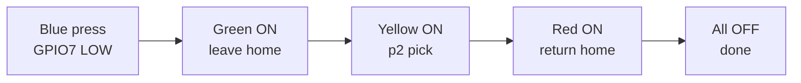
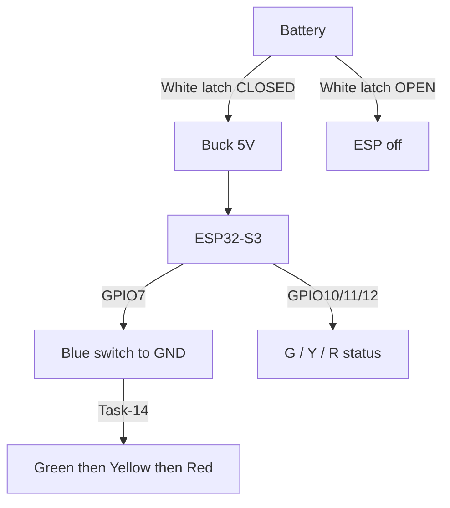

# Panel circuit simulator (mentor + self)

Interactive KiCad-style schematic for the ESP32-S3 call-station panel.

## Open it

1. Open `index.html` in Chrome / Edge / Firefox (double-click or drag into browser).
2. Click **White** → closes battery → buck → ESP power path (red wires).
3. Click **Blue** → closes GPIO7 ↔ GND, then runs **Task-14** LED sequence.

No Arduino upload needed for this folder — it is a teaching / mentor visual only.

## Task-14 (Blue button) — intended behavior

| Step | LED | Meaning |
|------|-----|---------|
| 1 | **Green ON** | AMR starting from home |
| 2 | Green OFF, **Yellow ON** | Go to **p2** to pick pallet |
| 3 | Yellow OFF, **Red ON** | Returning home |
| 4 | **Red OFF** | Sequence done |

## Circuit nets (matches real wiring)

```
Battery B+ ──► White SWITCH ──► Buck IN+
Battery B− ───────────────────► Buck IN−
Buck OUT+ ──► ESP32 5V
Buck OUT− ──► ESP32 GND ══╗
                          ║
COMMON GND ═══════════════╩══ White LED−
                              Blue LED−
                              Blue SWITCH return
                              Green/Yellow/Red module VCC

Blue SWITCH sense ──► GPIO7
White LED+ ──► GPIO13
Blue  LED+ ──► GPIO14
Green  IN ──► GPIO10
Yellow IN ──► GPIO11
Red    IN ──► GPIO12
```

## Is the circuit “closed” or a short?

| Action | Path that closes | Short VCC↔GND? |
|--------|------------------|----------------|
| White ON | B+ → switch → buck IN+ | No — this is the intended power path |
| Blue ON | GPIO7 → switch → common GND | No — only pull-up microamps |
| Status LED ON | GPIO 10/11/12 → module IN → VCC→GND | No — designed current path |

**Mentor 10k/15k:** not required as a series resistor on blue (GPIO↔GND). Do **not** copy `5V → switch → GPIO` on ESP32-S3 (GPIO is 3.3V only). Optional: 10k pull-up GPIO7 → 3.3V.

## Flow diagram (Task-14)



## Power + signal separation



## Firmware note

`panel_latch_led_test.ino` and main Call Mode firmware may still use older meanings (e.g. blue = cancel, green = running). This simulator documents **Task-14 as specified**. Say if you want the `.ino` files updated to match this sequence.
